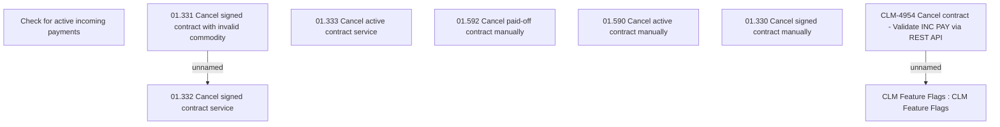

# CBL-18085 (CLM-4954) Cancel contract - Validate INC PAY via REST API

```mermaid
graph TD
    CLM_Feature_Flags_CLM_Feature_Flags["CLM Feature Flags : CLM Feature Flags"]
    Check_for_active_incoming_payments["Check for active incoming payments"]
    n_01_331_Cancel_signed_contract_with_invalid_commodity["01.331 Cancel signed contract with invalid commodity"]
    n_01_333_Cancel_active_contract_service["01.333 Cancel active contract service"]
    n_01_332_Cancel_signed_contract_service["01.332 Cancel signed contract service"]
    n_01_592_Cancel_paid_off_contract_manually["01.592 Cancel paid-off contract manually"]
    n_01_590_Cancel_active_contract_manually["01.590 Cancel active contract manually"]
    n_01_330_Cancel_signed_contract_manually["01.330 Cancel signed contract manually"]
    CLM_4954_Cancel_contract_Validate_INC_PAY_via_REST_API["CLM-4954 Cancel contract - Validate INC PAY via REST API"]
    CLM_4954_Cancel_contract_Validate_INC_PAY_via_REST_API -->|unnamed| CLM_Feature_Flags_CLM_Feature_Flags
    n_01_331_Cancel_signed_contract_with_invalid_commodity -->|unnamed| n_01_332_Cancel_signed_contract_service
```
