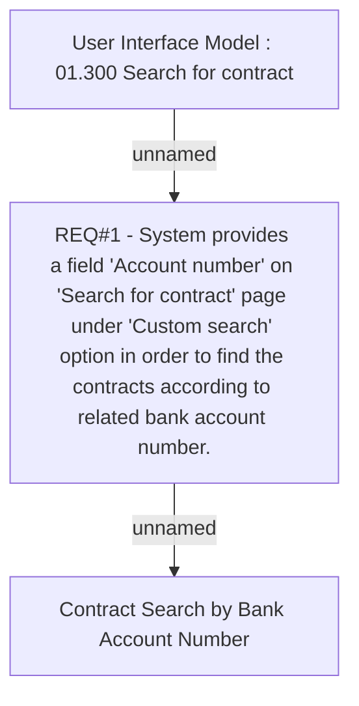

# CBL-1815 (CLM-989) Contract search by bank account number

```mermaid
graph TD
    User_Interface_Model_01_300_Search_for_contract["User Interface Model : 01.300 Search for contract"]
    REQ_1_System_provides_a_field_Account_number_on_Search_for_c["REQ#1 - System provides a field 'Account number' on 'Search for contract' page under 'Custom search' option in order to find the contracts according to related bank account number."]
    Contract_Search_by_Bank_Account_Number["Contract Search by Bank Account Number"]
    REQ_1_System_provides_a_field_Account_number_on_Search_for_c -->|unnamed| Contract_Search_by_Bank_Account_Number
    User_Interface_Model_01_300_Search_for_contract -->|unnamed| REQ_1_System_provides_a_field_Account_number_on_Search_for_c
```
