# CBL-18207 (CLM-5122) Document preview on Registration tab, Contract documents tab, Documents printouts tab

- **Diagram Type**: Custom
- **Package**: HomerSelect/BSL/Requirements Model/Finished/CLM/CBL-18207 (CLM-5122) Document preview on Registration tab, Contract documents tab, Documents printouts tab
- **Diagram ID**: 148882
- **Elements**: 14
- **Connectors**: 12

```mermaid
graph TD
    ADD_01_128_Preview_document_printouts["{ADD}01.128 Preview document printouts"]
    ADD_01_128_Preview_document_printout_with_security_level_2["{ADD}01.128 Preview document printout with security level 2"]
    ADD_01_128_Preview_document_printout_with_security_level_1["{ADD}01.128 Preview document printout with security level 1"]
    ADD_01_128_Preview_registration_document["{ADD}01.128 Preview registration document"]
    ADD_01_128_Preview_registration_document_file_download["{ADD}01.128 Preview registration document (file download)"]
    ADD_01_128_Preview_contract_document_with_security_level_2["{ADD}01.128 Preview contract document with security level 2"]
    ADD_01_128_Preview_contract_document_with_security_level_1["{ADD}01.128 Preview contract document with security level 1"]
    ADD_01_128_Preview_contract_document["{ADD}01.128 Preview contract document"]
    MOD_Preview_documents_based_on_security_level["{MOD}Preview documents based on security level"]
    Document_printouts_Document_printouts_Access_Rights["Document printouts : Document printouts - Access Rights"]
    AccessRights_AccessRights["AccessRights : AccessRights"]
    Contract_documents_Contract_documents_Access_Rights["Contract documents : Contract documents - Access Rights"]
    MOD_01_128_Preview_document["{MOD}01.128 Preview document"]
    CLM_5122_Doc_preview_on_tabs_Registration_Contract_documents["CLM-5122 Doc preview on tabs Registration, Contract documents, Document printouts"]
    MOD_01_128_Preview_document -->|unnamed| MOD_Preview_documents_based_on_security_level
    MOD_01_128_Preview_document -->|unnamed| ADD_01_128_Preview_contract_document_with_security_level_1
    MOD_01_128_Preview_document -->|unnamed| ADD_01_128_Preview_document_printout_with_security_level_2
    MOD_01_128_Preview_document -->|unnamed| ADD_01_128_Preview_registration_document
    MOD_01_128_Preview_document -->|unnamed| ADD_01_128_Preview_contract_document_with_security_level_2
    MOD_01_128_Preview_document -->|unnamed| ADD_01_128_Preview_registration_document_file_download
    MOD_01_128_Preview_document -->|unnamed| ADD_01_128_Preview_contract_document
    MOD_01_128_Preview_document -->|unnamed| ADD_01_128_Preview_document_printout_with_security_level_1
    MOD_01_128_Preview_document -->|unnamed| ADD_01_128_Preview_document_printouts
    MOD_01_128_Preview_document -->|unnamed| AccessRights_AccessRights
    MOD_01_128_Preview_document -->|unnamed| Document_printouts_Document_printouts_Access_Rights
    MOD_01_128_Preview_document -->|unnamed| Contract_documents_Contract_documents_Access_Rights
```

