# CBL-18402 (CLM-5045) JMS IN/OUT - Cleanup  - wave 1

- **Diagram Type**: Custom
- **Package**: HomerSelect/BSL/Requirements Model/Finished/CLM/CBL-18402 (CLM-5045) JMS IN/OUT - Cleanup  - wave 1
- **Diagram ID**: 147475
- **Elements**: 11
- **Connectors**: 0

```mermaid
graph TD
    DEL_01_902_Process_message_with_result_of_contract_sale["{DEL}01.902 Process message with result of contract sale"]
    Process_ContractSaleRequestedSE["Process ContractSaleRequestedSE"]
    Process_ClientIdChangedSE["Process ClientIdChangedSE"]
    External_Reference["External Reference"]
    DEL_SaleContractRequest["{DEL}SaleContractRequest"]
    DEL_SaleContractRequest["{DEL}SaleContractRequest"]
    DEL_SaleContractResponse["{DEL}SaleContractResponse"]
    DEL_ContractFullInfoRequest["{DEL]ContractFullInfoRequest"]
    CBL_18402_CLM_5045_JMS_IN_OUT_Cleanup_wave_1["CBL-18402 (CLM-5045) JMS IN/OUT - Cleanup  - wave 1"]
    DEL_ContractSecuritizationNotification["{DEL}ContractSecuritizationNotification"]
    DEL_ContractCreditAccountRequest["{DEL}ContractCreditAccountRequest"]
```

