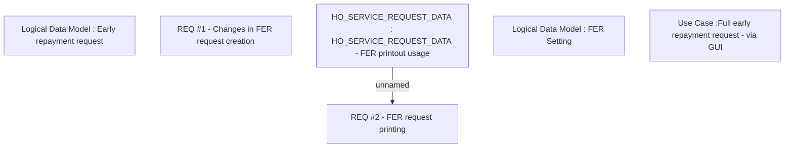

# CBL-1855 (CLM-956) Full early repayment services changes

- **Diagram Type**: Custom
- **Package**: HomerSelect/BSL/Requirements Model/Finished/CLM/CBL-1855 (CLM-956) Full early repayment services changes
- **Diagram ID**: 158894
- **Elements**: 6
- **Connectors**: 1

