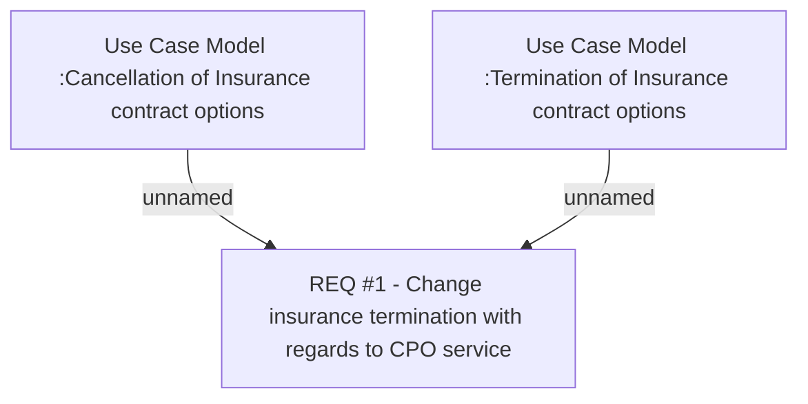

# CBL-1856 (CLM-928) Insurance Termination: Update Business Logic

- **Diagram Type**: Custom
- **Package**: HomerSelect/BSL/Requirements Model/Finished/CLM/CBL-1856 (CLM-928) Insurance Termination: Update Business Logic
- **Diagram ID**: 158905
- **Elements**: 3
- **Connectors**: 2

