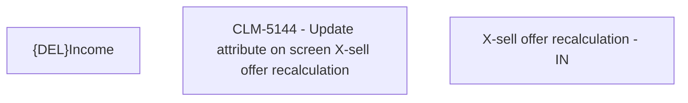

# CBL-18691 (CLM-5144) -  Update attribute on screen X-sell offer recalculation

- **Diagram Type**: Custom
- **Package**: HomerSelect/BSL/Requirements Model/Finished/CLM/CBL-18691 (CLM-5144) -  Update attribute on screen X-sell offer recalculation
- **Diagram ID**: 158919
- **Elements**: 3
- **Connectors**: 0

