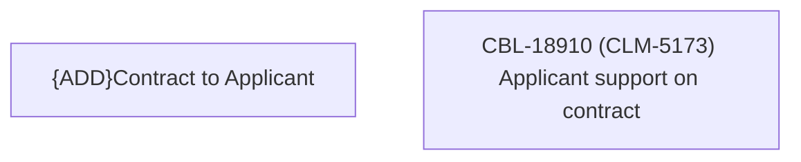

# CBL-18910 (CLM-5173) Applicant support on contract

```mermaid
graph TD
    ADD_Contract_to_Applicant["{ADD}Contract to Applicant"]
    CBL_18910_CLM_5173_Applicant_support_on_contract["CBL-18910 (CLM-5173) Applicant support on contract"]
```
