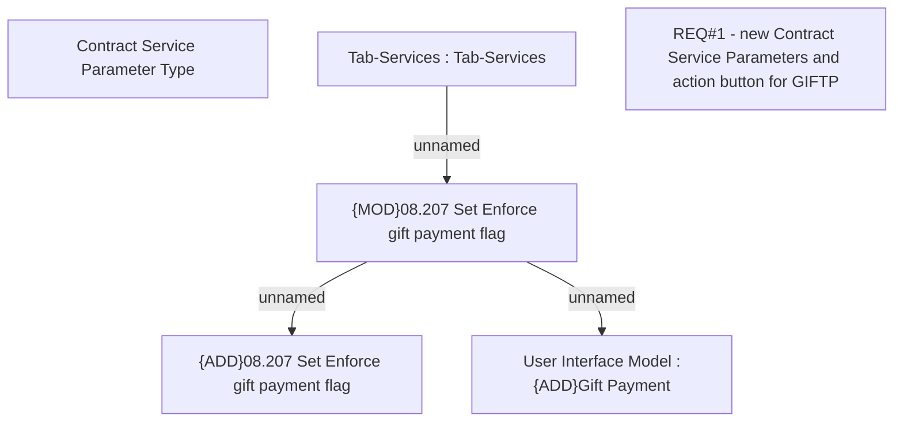

# CBL-1902 (CLM-969) Enforce gift payment without fulfilled eligibility criteria

- **Diagram Type**: Custom
- **Package**: HomerSelect/BSL/Requirements Model/Finished/CLM/CBL-1902 (CLM-969) Enforce gift payment without fulfilled eligibility criteria
- **Diagram ID**: 158909
- **Elements**: 6
- **Connectors**: 3

