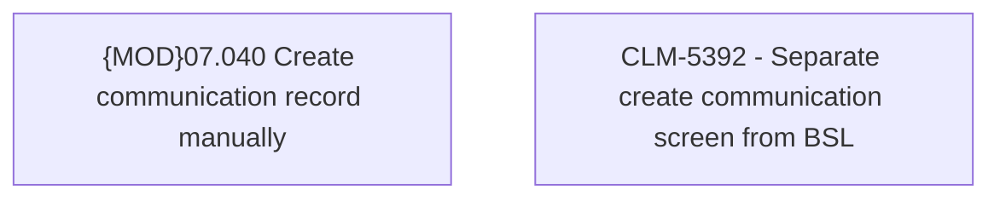

# CBL-19192 (CLM-5392) - Add create communication screen

- **Diagram Type**: Custom
- **Package**: HomerSelect/BSL/Requirements Model/Finished/CLM/CBL-19192 (CLM-5392) - Add create communication screen
- **Diagram ID**: 158921
- **Elements**: 2
- **Connectors**: 0

