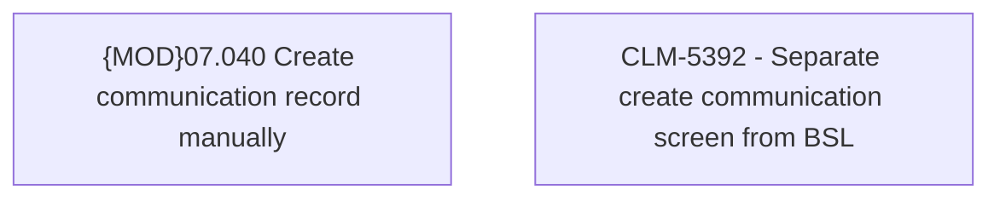

# CBL-19192 (CLM-5392) - Add create communication screen

```mermaid
graph TD
    MOD_07_040_Create_communication_record_manually["{MOD}07.040 Create communication record manually"]
    CLM_5392_Separate_create_communication_screen_from_BSL["CLM-5392 - Separate create communication screen from BSL"]
```
