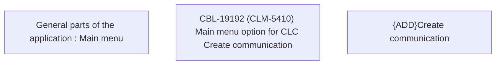

# CBL-19192 (CLM-5410) Main menu option for CLC Create communication

- **Diagram Type**: Custom
- **Package**: HomerSelect/BSL/Requirements Model/Finished/CLM/CBL-19192 (CLM-5410) Main menu option for CLC Create communication
- **Diagram ID**: 152860
- **Elements**: 3
- **Connectors**: 0

