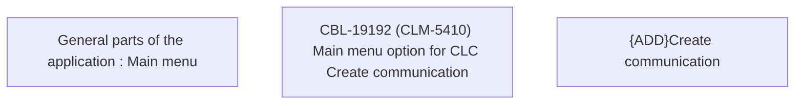

# CBL-19192 (CLM-5410) Main menu option for CLC Create communication

```mermaid
graph TD
    General_parts_of_the_application_Main_menu["General parts of the application : Main menu"]
    CBL_19192_CLM_5410_Main_menu_option_for_CLC_Create_communica["CBL-19192 (CLM-5410) Main menu option for CLC Create communication"]
    ADD_Create_communication["{ADD}Create communication"]
```
