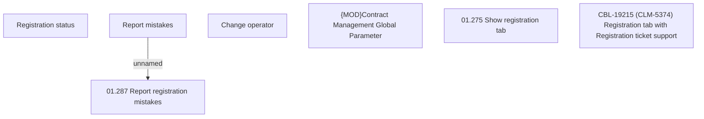

# CBL-19215 (CLM-5374) Registration tab with Registration ticket support

- **Diagram Type**: Custom
- **Package**: HomerSelect/BSL/Requirements Model/Finished/CLM/CBL-19215 (CLM-5374) Registration tab with Registration ticket support
- **Diagram ID**: 152861
- **Elements**: 7
- **Connectors**: 1

