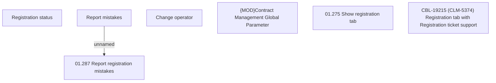

# CBL-19215 (CLM-5374) Registration tab with Registration ticket support

```mermaid
graph TD
    Registration_status["Registration status"]
    Report_mistakes["Report mistakes"]
    Change_operator["Change operator"]
    MOD_Contract_Management_Global_Parameter["{MOD}Contract Management Global Parameter"]
    n_01_275_Show_registration_tab["01.275 Show registration tab"]
    CBL_19215_CLM_5374_Registration_tab_with_Registration_ticket["CBL-19215 (CLM-5374) Registration tab with Registration ticket support"]
    n_01_287_Report_registration_mistakes["01.287 Report registration mistakes"]
    Report_mistakes -->|unnamed| n_01_287_Report_registration_mistakes
```
