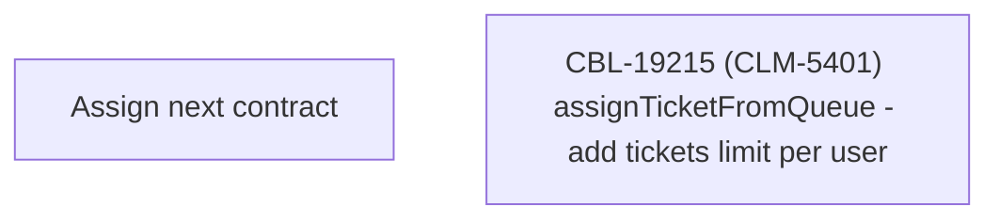

# CBL-19215 (CLM-5401) assignTicketFromQueue - add tickets limit per user

- **Diagram Type**: Custom
- **Package**: HomerSelect/BSL/Requirements Model/Finished/CLM/CBL-19215 (CLM-5401) assignTicketFromQueue - add tickets limit per user
- **Diagram ID**: 152863
- **Elements**: 2
- **Connectors**: 0

