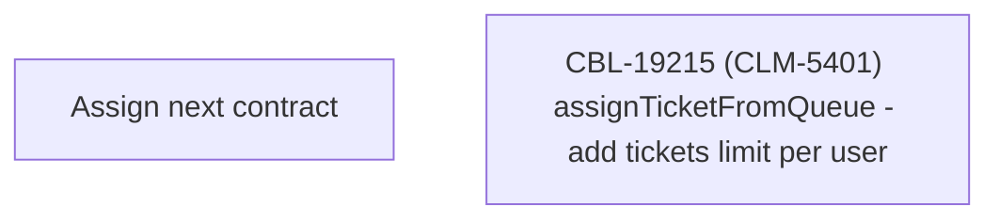

# CBL-19215 (CLM-5401) assignTicketFromQueue - add tickets limit per user

```mermaid
graph TD
    Assign_next_contract["Assign next contract"]
    CBL_19215_CLM_5401_assignTicketFromQueue_add_tickets_limit_p["CBL-19215 (CLM-5401) assignTicketFromQueue - add tickets limit per user"]
```
