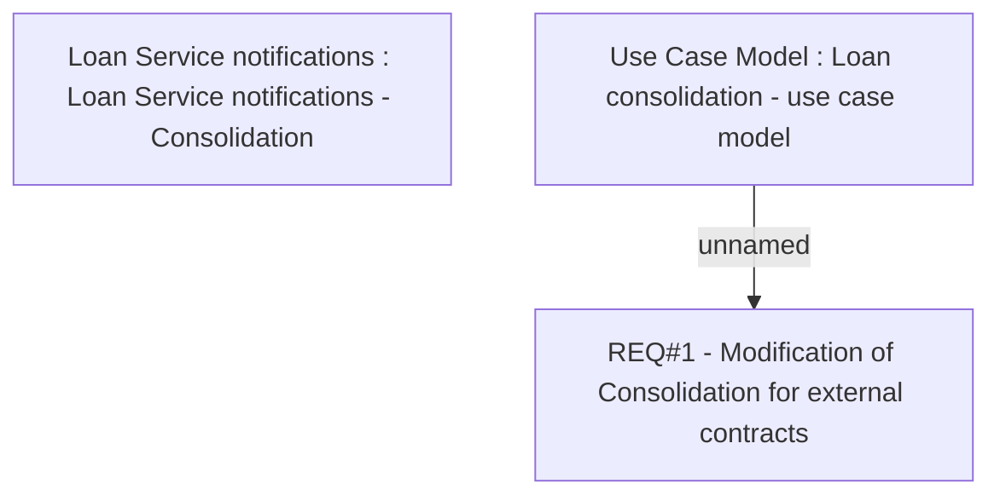

# CBL-1941 (CLM-987) External refinance

- **Diagram Type**: Custom
- **Package**: HomerSelect/BSL/Requirements Model/Finished/CLM/CBL-1941 (CLM-987) External refinance
- **Diagram ID**: 158902
- **Elements**: 3
- **Connectors**: 1

