# CBL-19733 (CLM-5626) TCK integration update

- **Diagram Type**: Custom
- **Package**: HomerSelect/BSL/Requirements Model/Finished/CLM/CBL-19733 (CLM-5626) TCK integration update
- **Diagram ID**: 153975
- **Elements**: 8
- **Connectors**: 0

```mermaid
graph TD
    DEL_01_278_Register_contract_automatically["{DEL}01.278 Register contract automatically"]
    MOD_01_289_Show_registration_queue_management["{MOD}01.289 Show registration queue management"]
    assignTicketFromQueue_assignTicketFromQueue["assignTicketFromQueue : assignTicketFromQueue"]
    Assign_next_contract["Assign next contract"]
    DEL_Registration_queue["{DEL}Registration queue"]
    n_01_271_Register_contract_remotely["01.271 Register contract remotely"]
    CBL_19733_CLM_5626_TCK_integration_update["CBL-19733 (CLM-5626) - TCK integration update"]
    n_01_270_Register_contract_manually["01.270 Register contract manually"]
```

