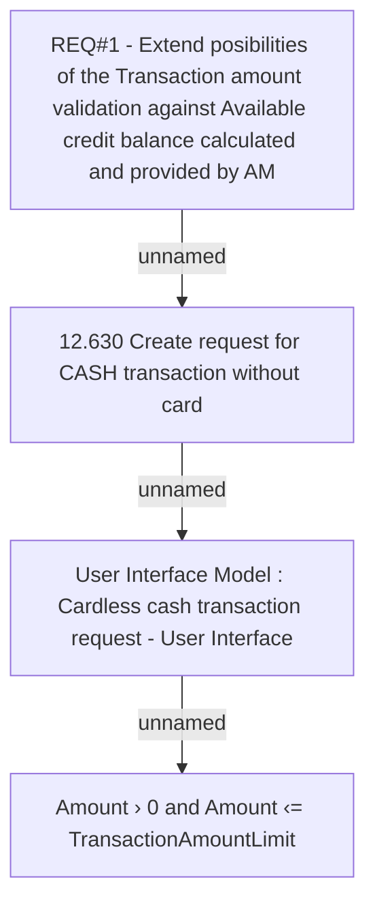

# CBL-2004 (CLM-1007) Loan on Phone Limit Calculation

```mermaid
graph TD
    Amount_0_and_Amount_TransactionAmountLimit["Amount › 0 and Amount ‹= TransactionAmountLimit"]
    User_Interface_Model_Cardless_cash_transaction_request_User_["User Interface Model : Cardless cash transaction request - User Interface"]
    n_12_630_Create_request_for_CASH_transaction_without_card["12.630 Create request for CASH transaction without card"]
    REQ_1_Extend_posibilities_of_the_Transaction_amount_validati["REQ#1 - Extend posibilities of the Transaction amount validation against Available credit balance calculated and provided by AM"]
    REQ_1_Extend_posibilities_of_the_Transaction_amount_validati -->|unnamed| n_12_630_Create_request_for_CASH_transaction_without_card
    n_12_630_Create_request_for_CASH_transaction_without_card -->|unnamed| User_Interface_Model_Cardless_cash_transaction_request_User_
    User_Interface_Model_Cardless_cash_transaction_request_User_ -->|unnamed| Amount_0_and_Amount_TransactionAmountLimit
```
