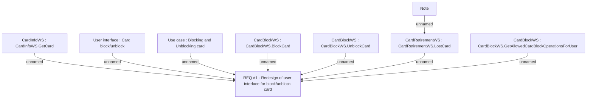

# CBL-2063 (CLM-1027) Add Block Reason for REL contract

```mermaid
graph TD
    CardBlockWS_CardBlockWS_UnblockCard["CardBlockWS : CardBlockWS.UnblockCard"]
    CardBlockWS_CardBlockWS_BlockCard["CardBlockWS : CardBlockWS.BlockCard"]
    el_1249130["Note"]
    CardInfoWS_CardInfoWS_GetCard["CardInfoWS : CardInfoWS.GetCard"]
    User_interface_Card_block_unblock["User interface : Card block/unblock"]
    Use_case_Blocking_Unblocking_card["Use case : Blocking and Unblocking card"]
    REQ_1_Redesign_of_user_interface_for_block_unblock_card["REQ #1 - Redesign of user interface for block/unblock card"]
    CardRetirementWS_CardRetirementWS_LostCard["CardRetirementWS : CardRetirementWS.LostCard"]
    CardBlockWS_CardBlockWS_GetAllowedCardBlockOperationsForUser["CardBlockWS : CardBlockWS.GetAllowedCardBlockOperationsForUser"]
    el_1249130 -->|unnamed| CardRetirementWS_CardRetirementWS_LostCard
    CardInfoWS_CardInfoWS_GetCard -->|unnamed| REQ_1_Redesign_of_user_interface_for_block_unblock_card
    User_interface_Card_block_unblock -->|unnamed| REQ_1_Redesign_of_user_interface_for_block_unblock_card
    Use_case_Blocking_Unblocking_card -->|unnamed| REQ_1_Redesign_of_user_interface_for_block_unblock_card
    CardBlockWS_CardBlockWS_BlockCard -->|unnamed| REQ_1_Redesign_of_user_interface_for_block_unblock_card
    CardBlockWS_CardBlockWS_UnblockCard -->|unnamed| REQ_1_Redesign_of_user_interface_for_block_unblock_card
    CardRetirementWS_CardRetirementWS_LostCard -->|unnamed| REQ_1_Redesign_of_user_interface_for_block_unblock_card
    CardBlockWS_CardBlockWS_GetAllowedCardBlockOperationsForUser -->|unnamed| REQ_1_Redesign_of_user_interface_for_block_unblock_card
```
