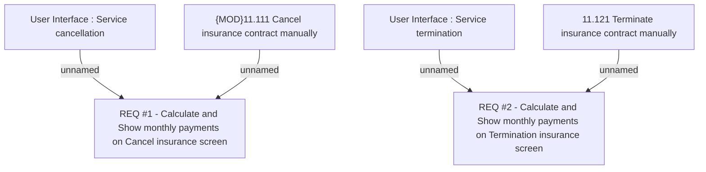

# CBL-2137 (CLM-1021) Insurance Cancellation or Termination - show Monthly payment info

- **Diagram Type**: Custom
- **Package**: HomerSelect/BSL/Requirements Model/Finished/CLM/CBL-2137 (CLM-1021) Insurance Cancellation or Termination - show Monthly payment info
- **Diagram ID**: 102490
- **Elements**: 6
- **Connectors**: 4

