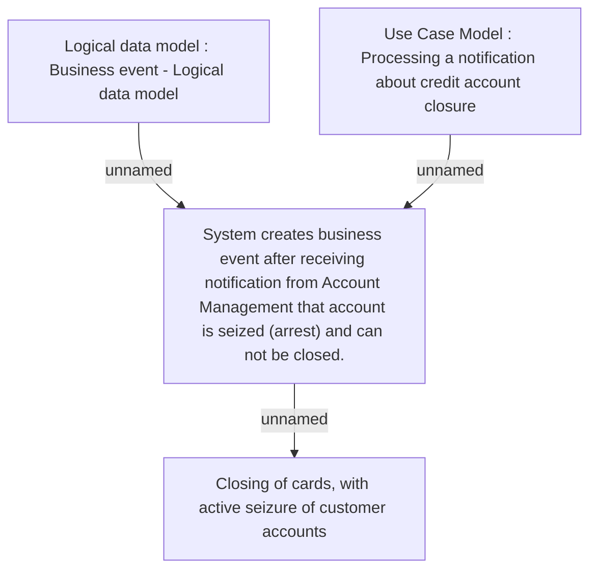

# CBL-2191 (CLM-1018) Closing of cards, with active seizure of customer accounts

- **Diagram Type**: Custom
- **Package**: HomerSelect/BSL/Requirements Model/Finished/CLM/CBL-2191 (CLM-1018) Closing of cards, with active seizure of customer accounts
- **Diagram ID**: 101257
- **Elements**: 4
- **Connectors**: 3

