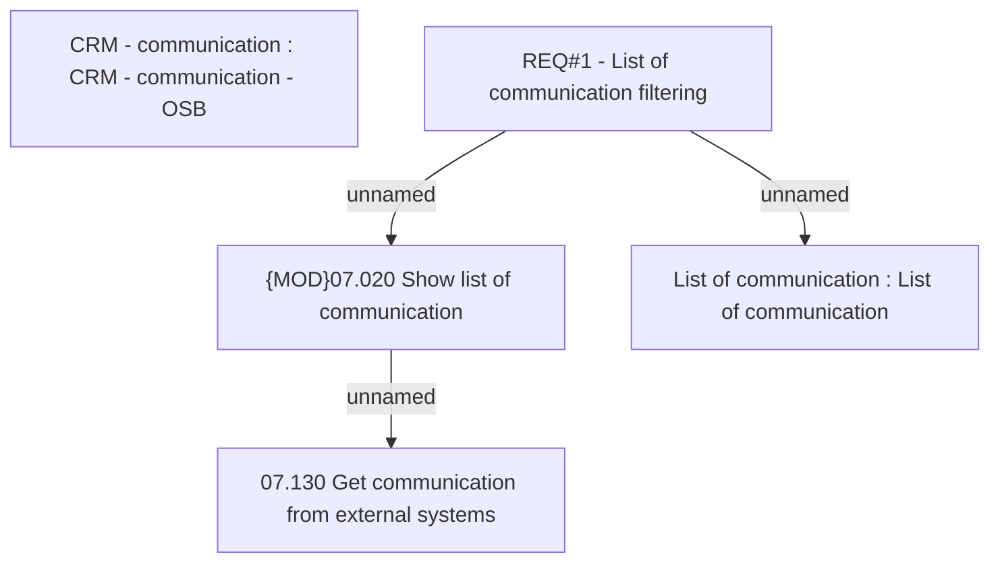

# CBL-2204 (CLM-1029) Filtering contact information in BSL

```mermaid
graph TD
    CRM_communication_CRM_communication_OSB["CRM - communication : CRM - communication - OSB"]
    n_07_130_Get_communication_from_external_systems["07.130 Get communication from external systems"]
    MOD_07_020_Show_list_of_communication["{MOD}07.020 Show list of communication"]
    List_of_communication_List_of_communication["List of communication : List of communication"]
    REQ_1_List_of_communication_filtering["REQ#1 - List of communication filtering"]
    REQ_1_List_of_communication_filtering -->|unnamed| MOD_07_020_Show_list_of_communication
    REQ_1_List_of_communication_filtering -->|unnamed| List_of_communication_List_of_communication
    MOD_07_020_Show_list_of_communication -->|unnamed| n_07_130_Get_communication_from_external_systems
```
