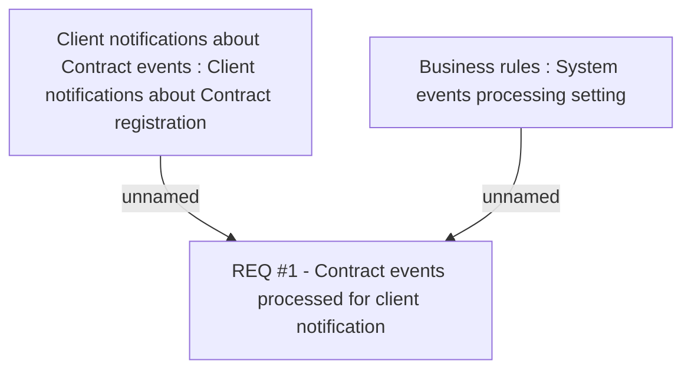

# CBL-2218 (CLM-1060) SMS informing clients about mobile applications

```mermaid
graph TD
    Business_rules_System_events_processing_setting["Business rules : System events processing setting"]
    Client_notifications_about_Contract_events_Client_notificati["Client notifications about Contract events : Client notifications about Contract registration"]
    REQ_1_Contract_events_processed_for_client_notification["REQ #1 - Contract events processed for client notification"]
    Client_notifications_about_Contract_events_Client_notificati -->|unnamed| REQ_1_Contract_events_processed_for_client_notification
    Business_rules_System_events_processing_setting -->|unnamed| REQ_1_Contract_events_processed_for_client_notification
```
