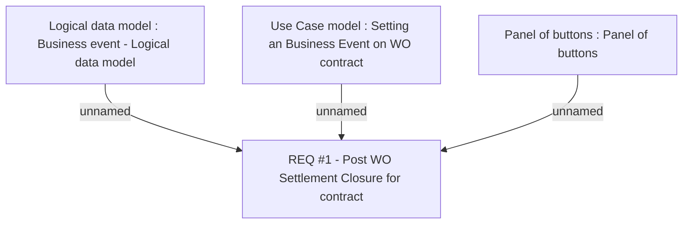

# CBL-2249 (CLM-1430) Post WO Settlement Closure Changes

- **Diagram Type**: Custom
- **Package**: HomerSelect/BSL/Requirements Model/Finished/CLM/CBL-2249 (CLM-1430) Post WO Settlement Closure Changes
- **Diagram ID**: 116686
- **Elements**: 4
- **Connectors**: 3

