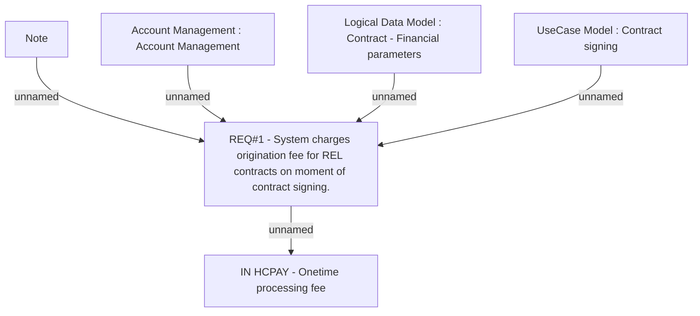

# CBL-2271 (CLM-1051) IN HCPAY - Onetime processing fee

```mermaid
graph TD
    el_1244860["Note"]
    Account_Management_Account_Management["Account Management : Account Management"]
    Logical_Data_Model_Contract_Financial_parameters["Logical Data Model : Contract - Financial parameters"]
    UseCase_Model_Contract_signing["UseCase Model : Contract signing"]
    REQ_1_System_charges_origination_fee_for_REL_contracts_on_mo["REQ#1 - System charges origination fee for REL contracts on moment of contract signing."]
    IN_HCPAY_Onetime_processing_fee["IN HCPAY - Onetime processing fee"]
    REQ_1_System_charges_origination_fee_for_REL_contracts_on_mo -->|unnamed| IN_HCPAY_Onetime_processing_fee
    el_1244860 -->|unnamed| REQ_1_System_charges_origination_fee_for_REL_contracts_on_mo
    Account_Management_Account_Management -->|unnamed| REQ_1_System_charges_origination_fee_for_REL_contracts_on_mo
    Logical_Data_Model_Contract_Financial_parameters -->|unnamed| REQ_1_System_charges_origination_fee_for_REL_contracts_on_mo
    UseCase_Model_Contract_signing -->|unnamed| REQ_1_System_charges_origination_fee_for_REL_contracts_on_mo
```
