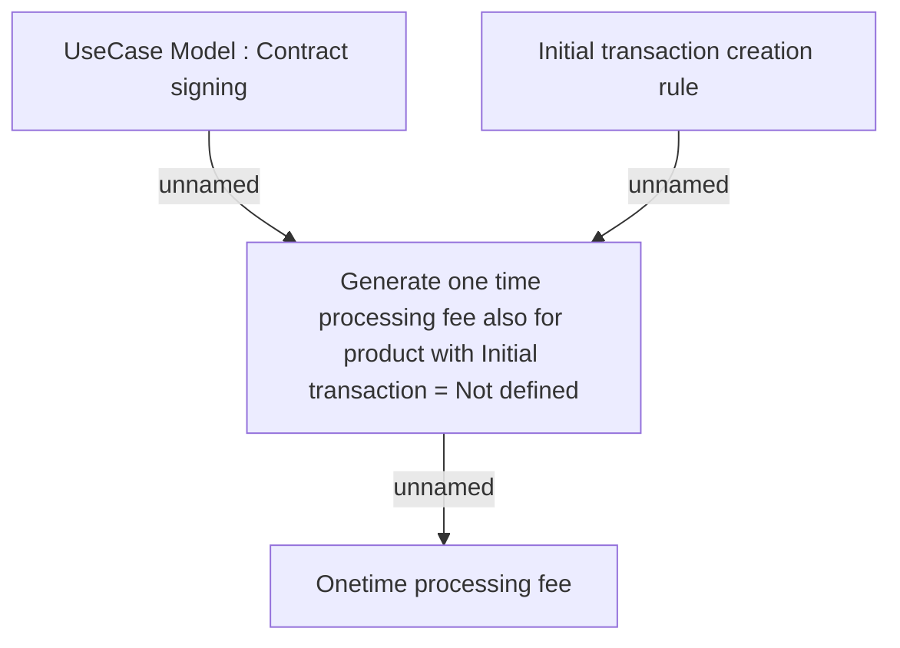

# CBL-2271 (TIN-9832) IN HCPAY - Onetime processing fee

```mermaid
graph TD
    Initial_transaction_creation_rule["Initial transaction creation rule"]
    UseCase_Model_Contract_signing["UseCase Model : Contract signing"]
    Generate_one_time_processing_fee_also_for_product_with_Initi["Generate one time processing fee also for product with Initial transaction = Not defined"]
    Onetime_processing_fee["Onetime processing fee"]
    Generate_one_time_processing_fee_also_for_product_with_Initi -->|unnamed| Onetime_processing_fee
    UseCase_Model_Contract_signing -->|unnamed| Generate_one_time_processing_fee_also_for_product_with_Initi
    Initial_transaction_creation_rule -->|unnamed| Generate_one_time_processing_fee_also_for_product_with_Initi
```
