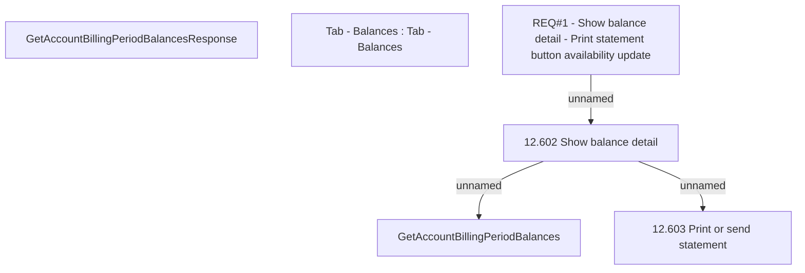

# CBL-2293 (CLM-1052) Statements cannot be opened

- **Diagram Type**: Custom
- **Package**: HomerSelect/BSL/Requirements Model/Finished/CLM/CBL-2293 (CLM-1052) Statements cannot be opened
- **Diagram ID**: 102168
- **Elements**: 6
- **Connectors**: 3

