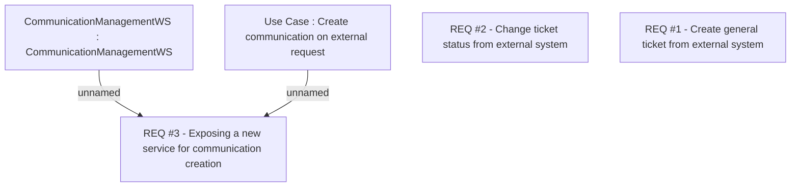

# CBL-2317 (CLM-1075) TCK - API for integration with 3rd Party ICF

- **Diagram Type**: Custom
- **Package**: HomerSelect/BSL/Requirements Model/Finished/CLM/CBL-2317 (CLM-1075) TCK - API for integration with 3rd Party ICF
- **Diagram ID**: 100554
- **Elements**: 5
- **Connectors**: 2

