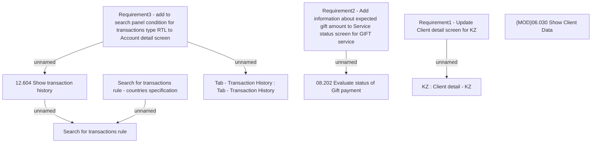

# CBL-2410 (CLM-1135) Genesys Operation Part - BSL change_DHS499

```mermaid
graph TD
    Search_for_transactions_rule_countries_specification["Search for transactions rule - countries specification"]
    Search_for_transactions_rule["Search for transactions rule"]
    n_12_604_Show_transaction_history["12.604 Show transaction history"]
    Tab_Transaction_History_Tab_Transaction_History["Tab - Transaction History : Tab - Transaction History"]
    Requirement3_add_to_search_panel_condition_for_transactions_["Requirement3 - add to search panel condition for transactions type RTL to Account detail screen"]
    n_08_202_Evaluate_status_of_Gift_payment["08.202 Evaluate status of Gift payment"]
    Requirement2_Add_information_about_expected_gift_amount_to_S["Requirement2 - Add information about expected gift amount to Service status screen for GIFT service"]
    KZ_Client_detail_KZ["KZ : Client detail - KZ"]
    Requirement1_Update_Client_detail_screen_for_KZ["Requirement1 - Update Client detail screen for KZ"]
    MOD_06_030_Show_Client_Data["{MOD}06.030 Show Client Data"]
    Requirement3_add_to_search_panel_condition_for_transactions_ -->|unnamed| n_12_604_Show_transaction_history
    Requirement3_add_to_search_panel_condition_for_transactions_ -->|unnamed| Tab_Transaction_History_Tab_Transaction_History
    Requirement2_Add_information_about_expected_gift_amount_to_S -->|unnamed| n_08_202_Evaluate_status_of_Gift_payment
    Requirement1_Update_Client_detail_screen_for_KZ -->|unnamed| KZ_Client_detail_KZ
    n_12_604_Show_transaction_history -->|unnamed| Search_for_transactions_rule
    Search_for_transactions_rule_countries_specification -->|unnamed| Search_for_transactions_rule
```
