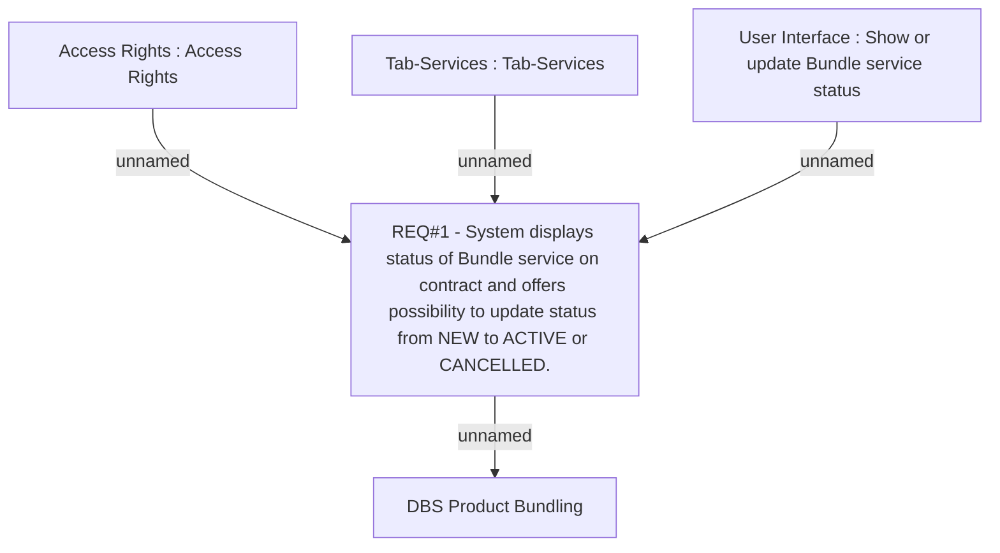

# CBL-2439 (CLM-1160) DBS Product Bundling

- **Diagram Type**: Custom
- **Package**: HomerSelect/BSL/Requirements Model/Finished/CLM/CBL-2439 (CLM-1160) DBS Product Bundling
- **Diagram ID**: 100568
- **Elements**: 5
- **Connectors**: 4

