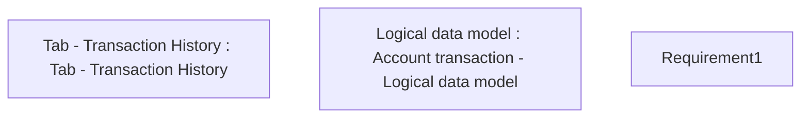

# CBL-25 (CLM-305) Receive Incoming VISA Direct

- **Diagram Type**: Custom
- **Package**: HomerSelect/BSL/Requirements Model/Finished/CLM/CBL-25 (CLM-305) Receive Incoming VISA Direct
- **Diagram ID**: 116263
- **Elements**: 3
- **Connectors**: 0

