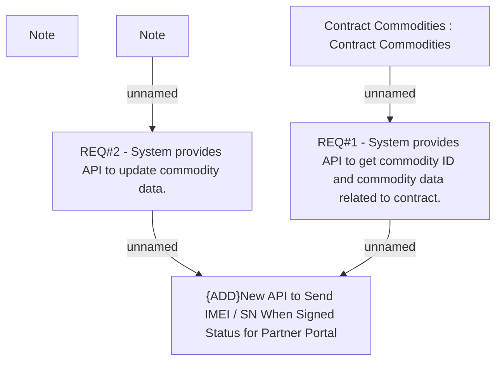

# CBL-2537 (CLM-1146) New API to Send IMEI / SN When Signed Status for Partner Portal

- **Diagram Type**: Custom
- **Package**: HomerSelect/BSL/Requirements Model/Finished/CLM/CBL-2537 (CLM-1146) New API to Send IMEI / SN When Signed Status for Partner Portal
- **Diagram ID**: 100569
- **Elements**: 6
- **Connectors**: 4

