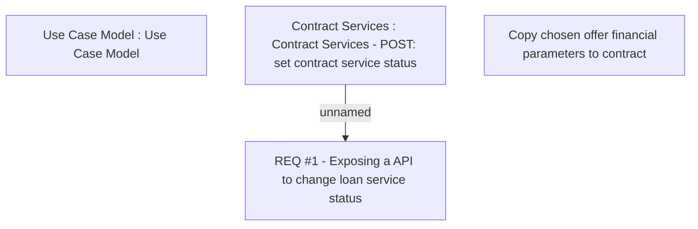

# CBL-2583 (CLM-1161) API to Update Account Opening Result for DBS Bundling Product

- **Diagram Type**: Custom
- **Package**: HomerSelect/BSL/Requirements Model/Finished/CLM/CBL-2583 (CLM-1161) API to Update Account Opening Result for DBS Bundling Product
- **Diagram ID**: 100678
- **Elements**: 4
- **Connectors**: 1

