# CBL-2620 (CLM-1155) New insurance types for REL products.docx

- **Diagram Type**: Custom
- **Package**: HomerSelect/BSL/Requirements Model/Finished/CLM/CBL-2620 (CLM-1155) New insurance types for REL products
- **Diagram ID**: 105602
- **Elements**: 16
- **Connectors**: 11

```mermaid
graph TD
    Use_Case_Model_Processing_a_notification_about_credit_accoun["Use Case Model : Processing a notification about credit account closure"]
    Use_Case_Model_Cancellation_of_Insurance_contract["Use Case Model : Cancellation of Insurance contract"]
    REQ_3_Modification_of_Insurance_cancellation["REQ #3 - Modification of Insurance cancellation"]
    User_Interface_Add_available_Insurance_on_Contract["User Interface : Add available Insurance on Contract"]
    Use_Case_Model_Adding_Insurance_on_REL_Contract["Use Case Model : Adding Insurance on REL Contract"]
    OutgoingPaymentsWS_OutgoingPaymentsWS["OutgoingPaymentsWS : OutgoingPaymentsWS"]
    Insurance_change_notifications_Insurance_change_notification["Insurance change notifications : Insurance change notifications"]
    Logical_Data_Model_Insurance_Contract["Logical Data Model : Insurance Contract"]
    Use_Case_Model_Insurance_based_on_EOM_message["Use Case Model : Insurance based on EOM message"]
    Create_insurance_contracts_for_insurance_services["Create insurance contracts for insurance services"]
    REQ_2_New_REL_insurance_types_Add_Start_and_Stop_insurance_o["REQ #2 - New REL insurance types: Add, Start and Stop insurance on demand"]
    REQ_1_New_REL_insurance_types_Automatic_start_and_processing["REQ #1 - New REL insurance types: Automatic start and processing"]
    Insurance_based_on_EOM_message_new_Insurance_based_on_EOM_me["Insurance based on EOM message (new) : Insurance based on EOM message"]
    Use_Case_Model_Insurance_based_on_EOM_event["Use Case Model :Insurance based on EOM event"]
    Insurance_Types_Insurance_Service["Insurance Types : Insurance Service"]
    REQ_0_Summary["REQ #0 - Summary"]
    Use_Case_Model_Insurance_based_on_EOM_event -->|unnamed| REQ_0_Summary
    Insurance_Types_Insurance_Service -->|unnamed| REQ_0_Summary
    Use_Case_Model_Insurance_based_on_EOM_message -->|unnamed| REQ_1_New_REL_insurance_types_Automatic_start_and_processing
    Insurance_change_notifications_Insurance_change_notification -->|unnamed| REQ_1_New_REL_insurance_types_Automatic_start_and_processing
    Logical_Data_Model_Insurance_Contract -->|unnamed| REQ_1_New_REL_insurance_types_Automatic_start_and_processing
    Insurance_based_on_EOM_message_new_Insurance_based_on_EOM_me -->|unnamed| REQ_1_New_REL_insurance_types_Automatic_start_and_processing
    User_Interface_Add_available_Insurance_on_Contract -->|unnamed| REQ_2_New_REL_insurance_types_Add_Start_and_Stop_insurance_o
    Use_Case_Model_Adding_Insurance_on_REL_Contract -->|unnamed| REQ_2_New_REL_insurance_types_Add_Start_and_Stop_insurance_o
    Use_Case_Model_Cancellation_of_Insurance_contract -->|unnamed| REQ_3_Modification_of_Insurance_cancellation
    Use_Case_Model_Processing_a_notification_about_credit_accoun -->|unnamed| REQ_3_Modification_of_Insurance_cancellation
    Create_insurance_contracts_for_insurance_services -->|unnamed| REQ_1_New_REL_insurance_types_Automatic_start_and_processing
```

