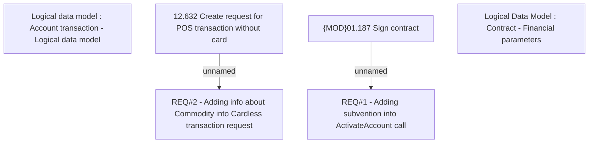

# CBL-2621 (CLM-1276) Financing schemes IV - Subventions for REL

```mermaid
graph TD
    REQ_2_Adding_info_about_Commodity_into_Cardless_transaction_["REQ#2 - Adding info about Commodity into Cardless transaction request"]
    REQ_1_Adding_subvention_into_ActivateAccount_call["REQ#1 - Adding subvention into ActivateAccount call"]
    Logical_data_model_Account_transaction_Logical_data_model["Logical data model : Account transaction - Logical data model"]
    n_12_632_Create_request_for_POS_transaction_without_card["12.632 Create request for POS transaction without card"]
    MOD_01_187_Sign_contract["{MOD}01.187 Sign contract"]
    Logical_Data_Model_Contract_Financial_parameters["Logical Data Model : Contract - Financial parameters"]
    MOD_01_187_Sign_contract -->|unnamed| REQ_1_Adding_subvention_into_ActivateAccount_call
    n_12_632_Create_request_for_POS_transaction_without_card -->|unnamed| REQ_2_Adding_info_about_Commodity_into_Cardless_transaction_
```
