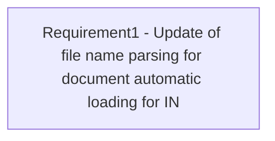

# CBL-2646 (CLM-1158) Naming convention of auto upload of client documents

- **Diagram Type**: Custom
- **Package**: HomerSelect/BSL/Requirements Model/Finished/CLM/CBL-2646 (CLM-1158) Naming convention of auto upload of client documents
- **Diagram ID**: 101977
- **Elements**: 1
- **Connectors**: 0

