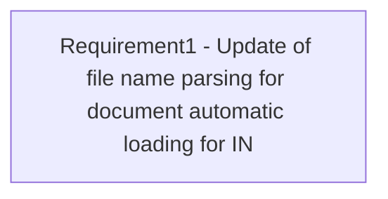

# CBL-2646 (CLM-1158) Naming convention of auto upload of client documents

```mermaid
graph TD
    Requirement1_Update_of_file_name_parsing_for_document_automa["Requirement1 - Update of file name parsing for document automatic loading for IN"]
```
