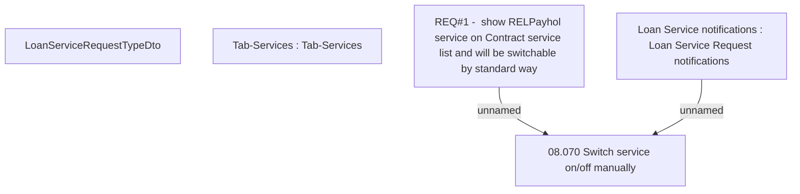

# CBL-268 (CLM-624) REL Payment holidays

- **Diagram Type**: Custom
- **Package**: HomerSelect/BSL/Requirements Model/Finished/CLM/CBL-268 (CLM-624) REL Payment holidays
- **Diagram ID**: 113482
- **Elements**: 5
- **Connectors**: 2

