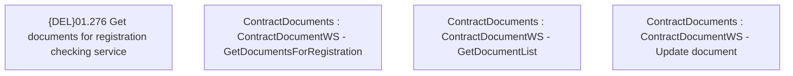

# CBL-2706 (CLM-1173) Change definition Document Attributes for GetDocumentList WS

- **Diagram Type**: Custom
- **Package**: HomerSelect/BSL/Requirements Model/Finished/CLM/CBL-2706 (CLM-1173) Change definition Document Attributes for GetDocumentList WS
- **Diagram ID**: 100234
- **Elements**: 4
- **Connectors**: 0

