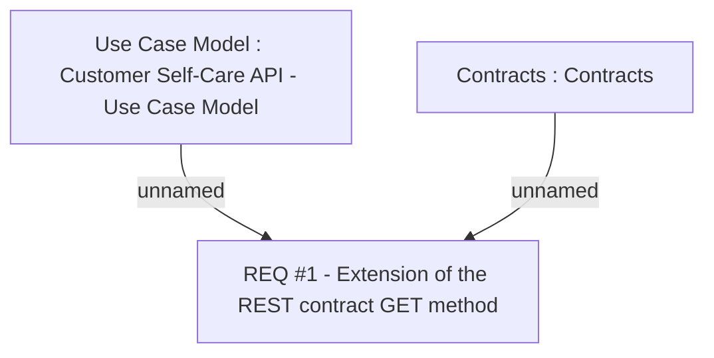

# CBL-2749 (CLM-1347) API to Get Detail Contract Information for Partner Portal

- **Diagram Type**: Custom
- **Package**: HomerSelect/BSL/Requirements Model/Finished/CLM/CBL-2749 (CLM-1347) API to Get Detail Contract Information for Partner Portal
- **Diagram ID**: 113483
- **Elements**: 3
- **Connectors**: 2

