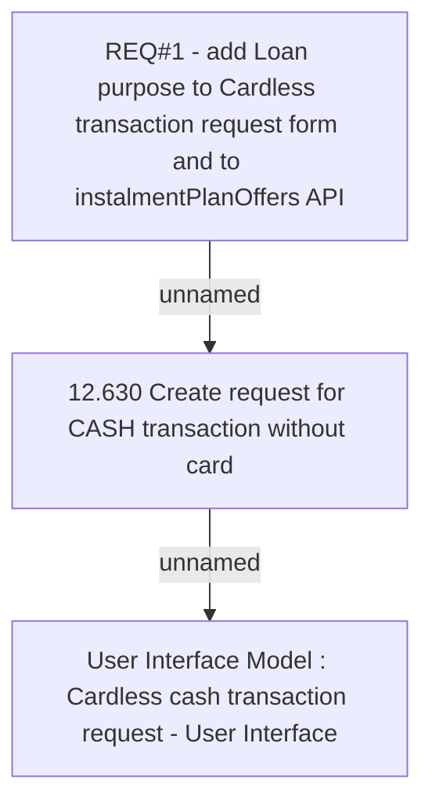

# CBL-2752 (CLM-1242) LOP Purpose Description for GUI and Billing Statement

- **Diagram Type**: Custom
- **Package**: HomerSelect/BSL/Requirements Model/Finished/CLM/CBL-2752 (CLM-1242) LOP Purpose Description for GUI and Billing Statement
- **Diagram ID**: 104029
- **Elements**: 3
- **Connectors**: 2

