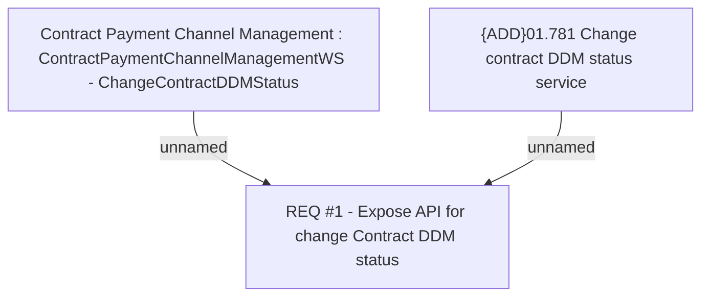

# CBL-2848 (CLM-1204) E-mandate DDM status update via Web Service

- **Diagram Type**: Custom
- **Package**: HomerSelect/BSL/Requirements Model/Finished/CLM/CBL-2848 (CLM-1204) E-mandate DDM status update via Web Service
- **Diagram ID**: 102542
- **Elements**: 3
- **Connectors**: 2

