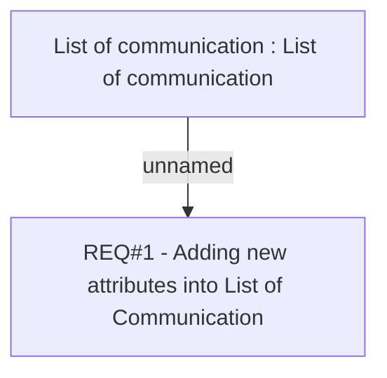

# CBL-2879 (CLM-1224) Additional Columns in Communication List History Table

- **Diagram Type**: Custom
- **Package**: HomerSelect/BSL/Requirements Model/Finished/CLM/CBL-2879 (CLM-1224) Additional Columns in Communication List History
- **Diagram ID**: 101975
- **Elements**: 2
- **Connectors**: 1

