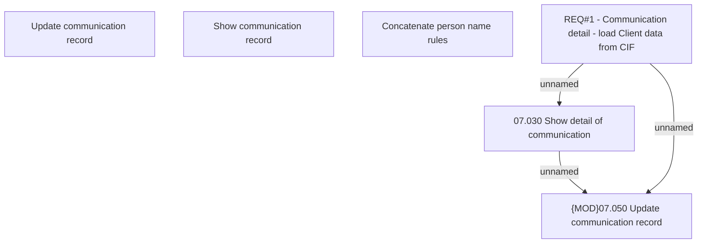

# CBL-2936 (CLM-1296) Communication detail - load Client data from CIF

```mermaid
graph TD
    MOD_07_050_Update_communication_record["{MOD}07.050 Update communication record"]
    Update_communication_record["Update communication record"]
    Show_communication_record["Show communication record"]
    Concatenate_person_name_rules["Concatenate person name rules"]
    n_07_030_Show_detail_of_communication["07.030 Show detail of communication"]
    REQ_1_Communication_detail_load_Client_data_from_CIF["REQ#1 - Communication detail - load Client data from CIF"]
    n_07_030_Show_detail_of_communication -->|unnamed| MOD_07_050_Update_communication_record
    REQ_1_Communication_detail_load_Client_data_from_CIF -->|unnamed| MOD_07_050_Update_communication_record
    REQ_1_Communication_detail_load_Client_data_from_CIF -->|unnamed| n_07_030_Show_detail_of_communication
```
