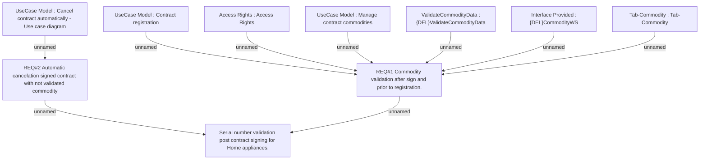

# CBL-2967 (CLM-2133) Serial number validation post contract signing for Home appliances

- **Diagram Type**: Custom
- **Package**: HomerSelect/BSL/Requirements Model/Finished/CLM/CBL-2967 (CLM-2133) Serial number validation post contract signing for Home appliances
- **Diagram ID**: 101258
- **Elements**: 10
- **Connectors**: 9

