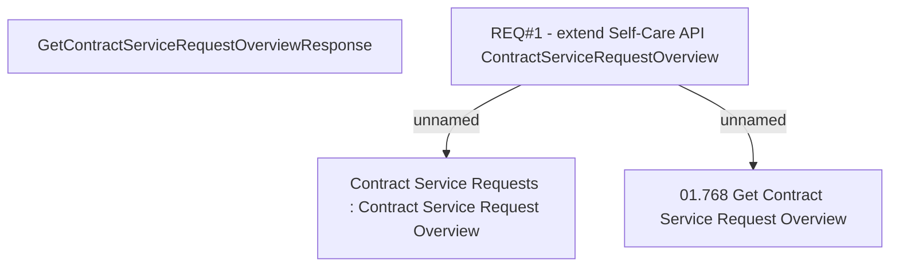

# CBL-2980 (CLM-1238) New functionality SPRAVKA in UFO

- **Diagram Type**: Custom
- **Package**: HomerSelect/BSL/Requirements Model/Finished/CLM/CBL-2980 (CLM-1238) New functionality SPRAVKA in UFO
- **Diagram ID**: 102170
- **Elements**: 4
- **Connectors**: 2

