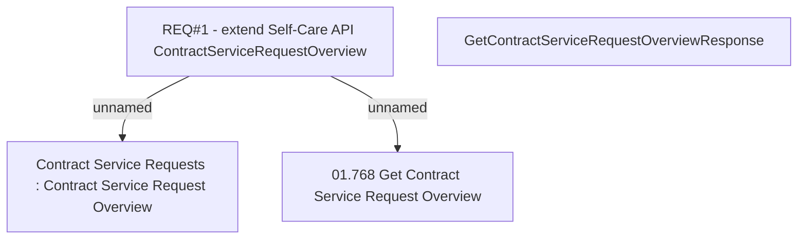

# CBL-2980 (CLM-1238) New functionality SPRAVKA in UFO

```mermaid
graph TD
    Contract_Service_Requests_Contract_Service_Request_Overview["Contract Service Requests : Contract Service Request Overview"]
    n_01_768_Get_Contract_Service_Request_Overview["01.768 Get Contract Service Request Overview"]
    REQ_1_extend_Self_Care_API_ContractServiceRequestOverview["REQ#1 - extend Self-Care API ContractServiceRequestOverview"]
    GetContractServiceRequestOverviewResponse["GetContractServiceRequestOverviewResponse"]
    REQ_1_extend_Self_Care_API_ContractServiceRequestOverview -->|unnamed| Contract_Service_Requests_Contract_Service_Request_Overview
    REQ_1_extend_Self_Care_API_ContractServiceRequestOverview -->|unnamed| n_01_768_Get_Contract_Service_Request_Overview
```
