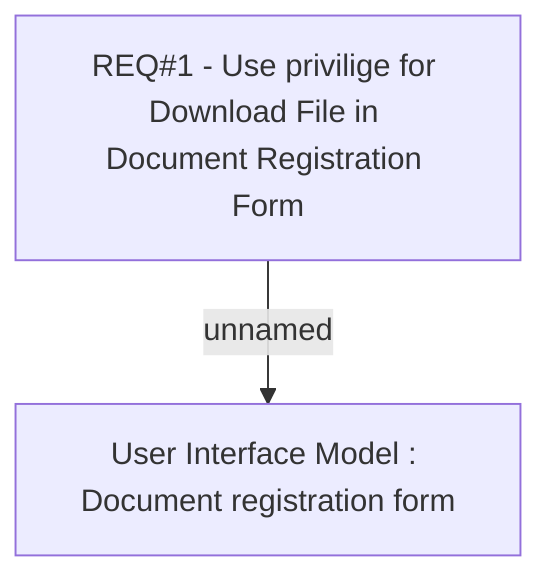

# CBL-2983 (CLM-1237) BSL: Remove Download File in Document Registration Form

- **Diagram Type**: Custom
- **Package**: HomerSelect/BSL/Requirements Model/Finished/CLM/CBL-2983 (CLM-1237) BSL: Remove Download File in Document Registration Form
- **Diagram ID**: 102565
- **Elements**: 2
- **Connectors**: 1

